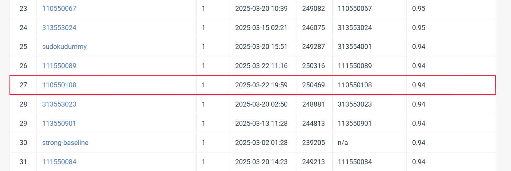

# Homework 1

StudentID: 110550108  
Name: 施柏江

## Introduction
The goal of this homework is to develop an image classification model for a dataset containing 100 classes. The task requires training a deep learning model to recognize images from different categories. My approach leverages a pre-trained ResNet-152 model and fine-tunes it for improved classification accuracy. I also explore the effects of different loss functions on model performance.

## Dataset
[Link to the dataset](https://drive.google.com/file/d/1fx4Z6xl5b6r4UFkBrn5l0oPEIagZxQ5u/view)

## Installation & Usage
### Prerequisites
Ensure you have the following installed:
- Python 3.8+
- PyTorch
- Torchvision
- Matplotlib
- PIL

### Running the Code
1. Clone this repository:
   ```bash
   git clone https://github.com/brianshih95/Visual-Recognition-using-Deep-Learning.git
   cd hw1
   ```
2. Train the model:
   ```bash
   python HW1_110550108.py
   ```
3. The trained model and predictions will be saved in the `output` folder.

## Results
- **Best validation accuracy:** 91.33%
- **Comparison of loss functions:**
  | Loss Function         | Final Validation Accuracy | Observations |
  |----------------------|--------------------------|-------------|
  | CrossEntropyLoss      | 91.33% | Baseline performance |
  | Focal Loss           | 90.67% | Improved stability, slightly lower accuracy |
  | Label Smoothing Loss | 90.33% | Better generalization, slower convergence |

## Performance Snapshot


## References
- ResNet Paper: [Deep Residual Learning for Image Recognition](https://arxiv.org/abs/1512.03385)
- PyTorch ResNet Implementation: [Official PyTorch Model Zoo](https://github.com/pytorch/vision/blob/main/torchvision/models/resnet.py)

---
For further details, refer to the [report](110550108_HW1.pdf).
