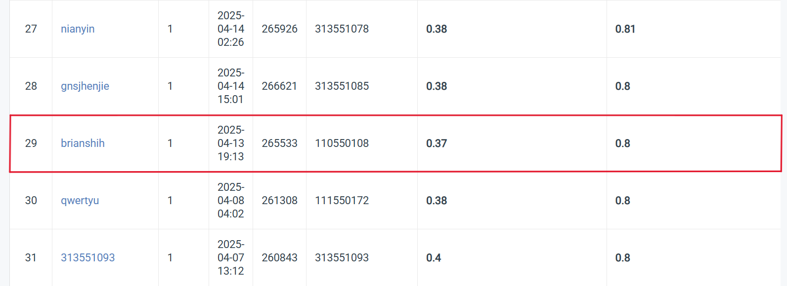
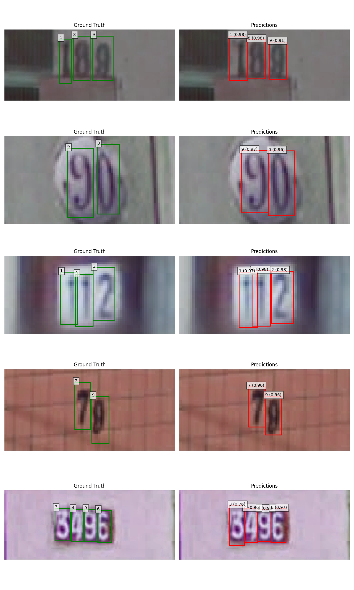

# Visual Recognition Homework 2: Digit Recognition with Faster R-CNN

StudentID: 110550108  
Name: 施柏江

## Introduction
This project implements a digit recognition system using **Faster R-CNN**. The task involves two objectives:
1. Detecting bounding boxes and class labels for each digit in an image.
2. Reconstructing the number sequence represented by the detected digits.

## Dataset
- **Format**: COCO-style annotation.
- **Train**: Annotated images with digit bounding boxes and class labels (0~9).
- **Test**: Unlabeled images, for inference only.

You can download the dataset [here](https://drive.google.com/file/d/13JXJ_hIdcloC63sS-vF3wFQLsUP1sMz5/view)

## Installation & Usage
### Prerequisites
- Python 3.8+
- PyTorch 2.0+
- TorchVision 0.15+

### Running the Code
1. Clone this repository:
   ```bash
   git clone https://github.com/brianshih95/Visual-Recognition-using-Deep-Learning.git
   cd hw2
   ```
2. Train the model:
   ```bash
   python 110550108_HW2.py
   ```
3. The trained model, predictions, and visualizations will be saved in the `output` folder.

## Method
- **Model**: `fasterrcnn_resnet50_fpn_v2` from TorchVision
- **Customizations**:
  - Anchor scales: (16, 32, 64, 128, 256)
  - Aspect ratios: (0.25, 0.5, 1.0)
  - Custom RoI head for 11 classes (0–9 + background)
  - Post-processing: confidence thresholding + x-axis sorting

- **Training**:
  - Optimizer: AdamW
  - Scheduler: OneCycleLR
  - Mixed-Precision: Enabled with PyTorch AMP
  - Epochs: 5
  - Batch Size: 32 (with gradient accumulation)
  - Learning Rate: 1e-4

## Results
- **Best Validation Loss**: `0.0771`
- **Comparison of loss functions:**
  | Loss Function            | Validation Loss | Observations                       |
  |--------------------------|-----------------|------------------------------------|
  | Smooth L1 (β=1.0)        | 0.0795          | Stable, good baseline              |
  | GIoU Loss                | 0.0823          | Tighter boxes but less stable      |
  | Smooth L1 (β=0.5)        | **0.0771**      | Best localization for small digits |

## Performance Snapshot
- Public Leaderboard
 

## Visualization
- Prediction Examples  
 

## References
- [Faster R-CNN Paper (Ren et al., 2015)](https://arxiv.org/abs/1506.01497)
- [TorchVision Faster R-CNN Source](https://github.com/pytorch/vision/blob/main/torchvision/models/detection/faster_rcnn.py)
- [Generalized IoU (Rezatofighi et al., 2019)](https://arxiv.org/abs/1902.09630)
- [PyTorch AMP Guide](https://pytorch.org/docs/stable/amp.html)

---
For further details, refer to the [report](110550108_HW2.pdf).
