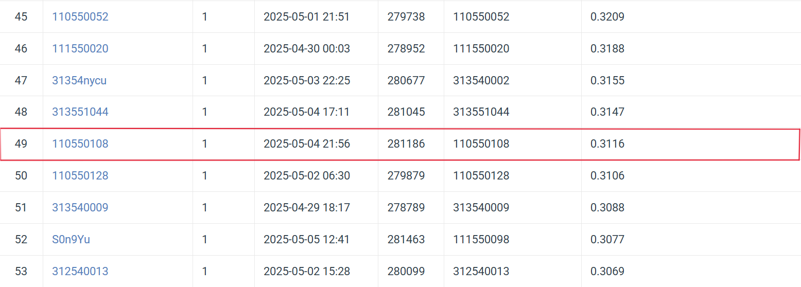

# Visual Recognition Homework 3: Cell Instance Segmentation

StudentID: 110550108  
Name: 施柏江

## Introduction

This project implements an **instance segmentation** pipeline for microscopic cell images using **Mask R-CNN**. The task involves:

1. Detecting individual cell instances with bounding boxes.
2. Generating pixel-level masks for each instance.

## Dataset

* **Format**: COCO-style annotation
* **Train**: Images with cell bounding boxes and masks
* **Test**: Unlabeled images (for inference only)

[Download dataset here](https://drive.google.com/file/d/1B0qWNzQZQmfQP7x7o4FDdgb9GvPDoFzI/view)

## Installation & Usage
### Prerequisites

* Python 3.8+
* PyTorch 2.0+
* TorchVision 0.15+

### Running the Code
1. Clone this repository:
   ```bash
   git clone https://github.com/brianshih95/Visual-Recognition-using-Deep-Learning.git
   cd hw3
   ```
2. Train the model:
   ```bash
   python 110550108_HW3.py
   ```
3. The trained model and predictions will be saved in the `output` folder.

## Method

* **Model**: `maskrcnn_resnet50_fpn_v2` from TorchVision

* **Customizations**:

  * Anchor Sizes: (4, 8, 16, 32, 64, 128)
  * Aspect Ratios: (0.5, 1.0, 1.5, 2.0)
  * Custom mask head for binary mask prediction
  * Post-processing: NMS + mask thresholding

* **Training**:

  * Optimizer: Adam
  * Scheduler: CosineAnnealing
  * Mixed-Precision: Enabled via PyTorch AMP
  * Epochs: 20
  * Batch Size: 2
  * Learning Rate: 1e-4


## Results

| Metric       | Value                                                                   |
| ------------ | ----------------------------------------------------------------------- |
| Val mAP      | **0.43**                                                                |
| Best Epoch   | 17                                                                       |
| Mask Quality | High on large/clear instances; less accurate on small/overlapping cells |

## Performance Snapshot
- Public Leaderboard
 

---
For further details, refer to the [report](110550108_HW3.pdf).