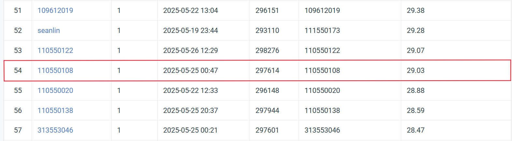

# Visual Recognition Homework 4: Image Restoration

StudentID: 110550108  
Name: 施柏江

## Introduction
This project implements a deep learning-based image restoration model for repairing images corrupted by rain and snow.


## Project Structure

```
├── src/                   # Source code
│   ├── main.py           # Main program entry
│   ├── model.py          # Model architecture definition
│   ├── train.py          # Training script
│   ├── validate.py       # Validation script
│   ├── dataset.py        # Dataset processing
│   ├── utils.py          # Utility functions
│   └── requirements.txt  # Project dependencies
└── 110550108_HW4.pdf            # Experiment report
```

## Requirements

- Python 3.9+
- PyTorch 1.9+
- CUDA (recommended for training)

## Running the Code

1. Clone the repository:
```bash
git clone https://github.com/brianshih95/Visual-Recognition-using-Deep-Learning.git
cd hw4
```

2. Install dependencies:
```bash
pip install -r src/requirements.txt
```

3. Train the model:
 ```bash
python src/main.py
```
4. The trained model, predictions and visualizations will be saved in the `asset` folder.

## Model Architecture

This project implements a PromptIR-based image restoration model with the following key features:

- Degradation-Aware Module
- Residual Groups
- Feed-Forward Network (FFN) Blocks
- Dual Attention Mechanism
- Ensemble Inference

Key training parameters:
- Optimizer: AdamW
- Learning Rate: OneCycleLR, base lr = 1e-4
- Batch Size: 16
- Epochs: 50 (with early stopping, patience=5)
- Loss Function: L1 + Perceptual + SSIM

## Training
Key training parameters:
- Optimizer: AdamW
- Learning Rate: OneCycleLR, base lr = 1e-4
- Batch Size: 16
- Epochs: 50 (with early stopping, patience=5)
- Loss Function: L1 + Perceptual + SSIM

## Results

- Model achieves best PSNR on validation set
- Supports restoration of both rain and snow degradation
- Enhanced robustness through ensemble inference

## Performance Snapshot
- Public Leaderboard
 
 
---
For further details, refer to the [report](110550108_HW4.pdf).